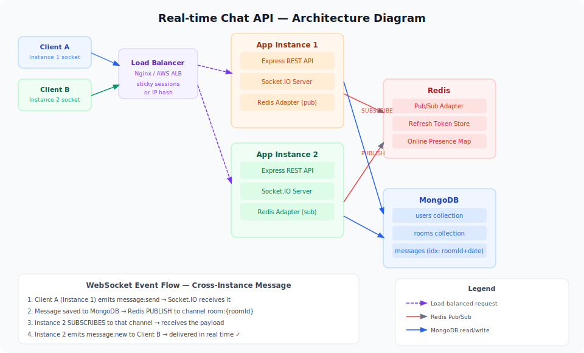

# 💬 Real-time Chat API

A horizontally scalable real-time chat backend with **WebSocket rooms**, **JWT auth with refresh tokens**, **cursor-based message pagination**, **Redis Pub/Sub** for multi-instance scaling, and **file/image message support** — built with Node.js, Socket.IO, MongoDB, and Redis.

---

## 📸 API Demo


> **Flow:** Register → Create Room → Connect Socket → Send Messages

```
POST /api/auth/register        →  { accessToken, refreshToken }
POST /api/rooms                →  { id, name, members: [] }
WS   socket.connect(token)     →  authenticated socket
     socket.emit('room:join')  →  joins room
     socket.emit('msg:send')   →  broadcasts to room members
     socket.on('msg:new')      →  receives real-time message
GET  /api/messages/:roomId     →  paginated message history
```

**Postman Collection:** Import `docs/postman_collection.json` — includes WebSocket test scripts via Socket.IO client.

---

## 🏗️ Architecture



```
┌──────────────────────────────────────────────────────────────────┐
│                    CLIENTS (Browser / Mobile)                      │
│              HTTP Requests        WebSocket Connection              │
└──────────────┬────────────────────────────┬──────────────────────┘
               │                            │
               ▼                            ▼
┌──────────────────────────────────────────────────────────────────┐
│                  Node.js Server (Express + Socket.IO)             │
│                                                                    │
│   ┌─────────────────┐          ┌──────────────────────────────┐  │
│   │   REST Routes   │          │      Socket.IO Server         │  │
│   │  /api/auth      │          │                              │  │
│   │  /api/rooms     │          │  io.use(jwtMiddleware)        │  │
│   │  /api/messages  │          │                              │  │
│   └────────┬────────┘          │  on('room:join')             │  │
│            │                   │  on('message:send')          │  │
│            │                   │  on('typing:start/stop')     │  │
│            │                   │  on('message:read')          │  │
│            │                   └──────────────┬───────────────┘  │
└────────────┼──────────────────────────────────┼──────────────────┘
             │                                  │
             ▼                                  ▼
┌─────────────────────────┐     ┌───────────────────────────────┐
│   MongoDB (Mongoose)    │     │      Redis                     │
│                         │     │                                │
│   Users collection      │     │  Pub/Sub Adapter               │
│   Rooms collection      │     │  (enables multiple instances   │
│   Messages collection   │◄────│   to broadcast to each other) │
│                         │     │                                │
│   Index: roomId +       │     │  Online presence tracking      │
│   createdAt (DESC)      │     │  Refresh token store           │
└─────────────────────────┘     └───────────────────────────────┘

SCALING NOTE:
When you run 2+ app instances behind a load balancer,
Socket.IO needs Redis Pub/Sub so Instance A can broadcast
to clients connected to Instance B:

  Client A ──► Instance 1 ──► Redis PUBLISH ──► Instance 2 ──► Client B
```

**Key design decisions:**
- **Cursor-based pagination** instead of offset — `?cursor=<lastMessageId>` is O(log n) via the index, while `OFFSET 1000` is O(n)
- **Refresh token rotation** — each refresh issues a new refresh token and invalidates the old one (stored in Redis), preventing replay attacks
- **Redis Pub/Sub adapter** — `@socket.io/redis-adapter` means the app is horizontally scalable from day one with zero code changes
- **Soft-delete messages** — `deletedAt` timestamp instead of hard delete preserves room history and analytics

---

## ⚡ Quick Start

### With Docker (recommended)

```bash
git clone https://github.com/yourusername/realtime-chat-api.git
cd realtime-chat-api

cp .env.example .env

# Start MongoDB + Redis + App
docker compose up -d

# Verify all 3 containers are healthy
docker compose ps

# View live logs
docker compose logs -f app
```

### Without Docker (local dev)

```bash
# Prerequisites: Node 18+, MongoDB 6, Redis 7

npm install
cp .env.example .env
# Edit .env with your local credentials

npm run dev
# Server + Socket.IO ready on http://localhost:3000
```

### Environment Variables

```env
# .env.example
NODE_ENV=development
PORT=3000

MONGO_URI=mongodb://localhost:27017/chatapi
REDIS_URL=redis://localhost:6379

JWT_SECRET=your-access-token-secret-change-this
REFRESH_SECRET=your-refresh-token-secret-change-this
JWT_EXPIRES_IN=15m
REFRESH_EXPIRES_IN=7d

# Optional: AWS S3 for file uploads
AWS_ACCESS_KEY_ID=
AWS_SECRET_ACCESS_KEY=
AWS_REGION=ap-south-1
S3_BUCKET=
```

---

## 📡 REST API Reference

### Auth

#### Register
```bash
curl -X POST http://localhost:3000/api/auth/register \
  -H "Content-Type: application/json" \
  -d '{
    "username": "johndoe",
    "email": "john@example.com",
    "password": "SecurePass123!"
  }'

# Response 201
{
  "accessToken": "eyJhbGci...",
  "refreshToken": "eyJhbGci...",
  "user": {
    "id": "65f1a2b3c4d5e6f7a8b9c0d1",
    "username": "johndoe",
    "email": "john@example.com"
  }
}
```

#### Login
```bash
curl -X POST http://localhost:3000/api/auth/login \
  -H "Content-Type: application/json" \
  -d '{ "email": "john@example.com", "password": "SecurePass123!" }'
```

#### Refresh Access Token
```bash
curl -X POST http://localhost:3000/api/auth/refresh \
  -H "Content-Type: application/json" \
  -d '{ "refreshToken": "eyJhbGci..." }'

# Response 200 — new pair issued, old refreshToken invalidated
{
  "accessToken": "eyJhbGci...",
  "refreshToken": "eyJhbGci..."
}
```

---

### Rooms

#### Create Room
```bash
curl -X POST http://localhost:3000/api/rooms \
  -H "Authorization: Bearer ACCESS_TOKEN" \
  -H "Content-Type: application/json" \
  -d '{
    "name": "general",
    "description": "General discussion",
    "isPrivate": false
  }'

# Response 201
{
  "id": "65f1a2b3c4d5e6f7a8b9c0d2",
  "name": "general",
  "description": "General discussion",
  "isPrivate": false,
  "members": ["65f1a2b3c4d5e6f7a8b9c0d1"],
  "createdAt": "2024-03-13T08:00:00.000Z"
}
```

#### List All Rooms
```bash
curl "http://localhost:3000/api/rooms?page=1&limit=20" \
  -H "Authorization: Bearer ACCESS_TOKEN"
```

#### Join Room
```bash
curl -X POST http://localhost:3000/api/rooms/ROOM_ID/join \
  -H "Authorization: Bearer ACCESS_TOKEN"
```

#### Leave Room
```bash
curl -X POST http://localhost:3000/api/rooms/ROOM_ID/leave \
  -H "Authorization: Bearer ACCESS_TOKEN"
```

---

### Messages

#### Get Message History (cursor-based pagination)
```bash
# First page (most recent 30 messages)
curl "http://localhost:3000/api/messages/ROOM_ID" \
  -H "Authorization: Bearer ACCESS_TOKEN"

# Response 200
{
  "messages": [
    {
      "_id": "65f1a2b3c4d5e6f7a8b9c0d3",
      "content": "Hello everyone!",
      "type": "text",
      "sender": { "_id": "...", "username": "johndoe" },
      "readBy": ["65f1a2b3..."],
      "createdAt": "2024-03-13T10:30:00.000Z"
    }
  ],
  "nextCursor": "65f1a2b3c4d5e6f7a8b9c0c9"
}

# Load older messages using cursor
curl "http://localhost:3000/api/messages/ROOM_ID?cursor=65f1a2b3c4d5e6f7a8b9c0c9" \
  -H "Authorization: Bearer ACCESS_TOKEN"
```

#### Upload File Message
```bash
curl -X POST http://localhost:3000/api/messages/ROOM_ID/upload \
  -H "Authorization: Bearer ACCESS_TOKEN" \
  -F "file=@/path/to/image.jpg"

# Response 201
{
  "_id": "...",
  "type": "image",
  "fileUrl": "https://s3.amazonaws.com/bucket/uploads/uuid.jpg",
  "sender": { "username": "johndoe" }
}
```

---

## 🔌 WebSocket Events Reference

Connect with the Socket.IO client (any language):

```javascript
// Browser / Node.js client example
import { io } from "socket.io-client";

const socket = io("http://localhost:3000", {
  auth: { token: "YOUR_ACCESS_TOKEN" }
});

socket.on("connect", () => console.log("Connected:", socket.id));
socket.on("connect_error", (err) => console.error("Auth failed:", err.message));
```

### Events You Emit (Client → Server)

| Event | Payload | Description |
|-------|---------|-------------|
| `room:join` | `{ roomId }` | Join a room's socket channel |
| `room:leave` | `{ roomId }` | Leave a room's socket channel |
| `message:send` | `{ roomId, content, type? }` | Send a text message |
| `typing:start` | `{ roomId }` | Broadcast "is typing..." to room |
| `typing:stop` | `{ roomId }` | Stop typing indicator |
| `message:read` | `{ messageId }` | Mark message as read |

```javascript
// Join a room
socket.emit("room:join", { roomId: "65f1a2b3..." });

// Send a message
socket.emit("message:send", {
  roomId: "65f1a2b3...",
  content: "Hey everyone! 👋",
  type: "text"
});

// Typing indicator
inputEl.addEventListener("input", () => {
  socket.emit("typing:start", { roomId });
  clearTimeout(typingTimer);
  typingTimer = setTimeout(() => socket.emit("typing:stop", { roomId }), 1000);
});
```

### Events You Listen To (Server → Client)

| Event | Payload | Description |
|-------|---------|-------------|
| `message:new` | `{ _id, content, sender, createdAt }` | New message in a joined room |
| `room:user_joined` | `{ userId, roomId }` | Someone joined the room |
| `room:user_left` | `{ userId, roomId }` | Someone left the room |
| `typing:start` | `{ userId, roomId }` | User started typing |
| `typing:stop` | `{ userId, roomId }` | User stopped typing |
| `user:online` | `{ userId }` | User came online |
| `user:offline` | `{ userId }` | User went offline |
| `message:read` | `{ messageId, userId }` | Read receipt |
| `error` | `{ message }` | Error from server |

```javascript
socket.on("message:new", (message) => {
  appendMessageToUI(message);
});

socket.on("typing:start", ({ userId }) => {
  showTypingIndicator(userId);
});

socket.on("user:online", ({ userId }) => {
  updatePresenceDot(userId, true);
});
```

---

## 🧪 Running Tests

```bash
npm test

# Example output:
# PASS  tests/auth.test.js
#   Auth Routes
#     ✓ should register a new user (89ms)
#     ✓ should reject duplicate email (23ms)
#     ✓ should return 401 on wrong password (18ms)
#     ✓ should refresh token and invalidate old one (45ms)
#
# PASS  tests/messages.test.js
#   Message Service
#     ✓ should paginate with cursor correctly (31ms)
#     ✓ nextCursor is null on last page (12ms)
#     ✓ soft-deleted messages excluded from history (9ms)
```

---

## 🗂️ Project Structure

```
realtime-chat-api/
├── src/
│   ├── routes/
│   │   ├── auth.js           # POST /register, /login, /refresh
│   │   ├── rooms.js          # CRUD rooms + join/leave
│   │   └── messages.js       # GET history + file upload
│   ├── middleware/
│   │   ├── auth.js           # JWT verify (HTTP)
│   │   └── errorHandler.js   # Global error handler
│   ├── models/
│   │   ├── User.js           # username, email, password, avatar
│   │   ├── Room.js           # name, isPrivate, members, admins
│   │   └── Message.js        # roomId, sender, content, type, readBy
│   ├── socket/
│   │   └── index.js          # Socket.IO server + Redis adapter + all handlers
│   ├── services/
│   │   ├── authService.js    # register, login, refresh (token rotation)
│   │   └── messageService.js # sendMessage, getMessages (cursor), delete
│   └── app.js                # Express + httpServer + Socket.IO init
├── tests/
│   ├── auth.test.js
│   ├── rooms.test.js
│   └── messages.test.js
├── docker-compose.yml
├── Dockerfile
├── .env.example
└── README.md
```

---

## 🧠 What I Learned Building This

**Cursor-based pagination is non-negotiable for chat**
I initially implemented offset-based pagination (`skip: page * limit`). It worked but slowed down noticeably after 10,000 messages because MongoDB still scans all skipped documents. Switching to cursor-based pagination (`_id: { $lt: cursor }`) with a compound index on `(roomId, createdAt DESC)` brought query time from ~80ms to ~4ms on a 100k message collection. The cursor is just the `_id` of the last message — simple and stateless.

**JWT access + refresh token rotation**
Short-lived access tokens (15 min) mean a stolen token expires quickly. But constantly re-logging-in is bad UX. Refresh tokens solve this — but storing them statefully in Redis (and deleting the old one on each refresh) prevents replay attacks if a refresh token is somehow leaked. The "aha" moment was realizing the refresh token must be invalidated on use, not just issued alongside a new one.

**Redis Pub/Sub for Socket.IO — understanding WHY it's needed**
When you run a single server, socket broadcasts just work. When you deploy two instances behind a load balancer, Client A on Instance 1 sends a message, and Socket.IO tries to broadcast to Room X — but Client B is connected to Instance 2 and never gets it. Redis Pub/Sub is the message bus between instances. The `@socket.io/redis-adapter` handles this transparently — zero code changes needed to scale from 1 to N instances.

**Typing indicators — the "debounce on the client" pattern**
Emitting `typing:start` on every keystroke would spam the server. The correct pattern is: emit `typing:start` on the first keystroke, then `typing:stop` after 1 second of inactivity using a debounce timeout. This gives a smooth experience with a fraction of the events. I also learned NOT to persist typing events to the DB — they're ephemeral and should only travel over WebSocket.

**Mongoose indexes matter from day one**
Adding `messageSchema.index({ roomId: 1, createdAt: -1 })` after the fact required an index build on a live collection — painful. The lesson: think about query patterns before writing the first document. Every `find()` with a filter field should have an index.

---

## 🚀 Possible Extensions

- [ ] End-to-end encryption (client-side, Signal Protocol)
- [ ] Push notifications via FCM/APNs when user is offline
- [ ] Message reactions (emoji responses)
- [ ] Bot framework — a room can have bot members that respond to commands
- [ ] Voice/video call signaling via WebRTC + Socket.IO as the signaling layer

---

## 📄 License

MIT